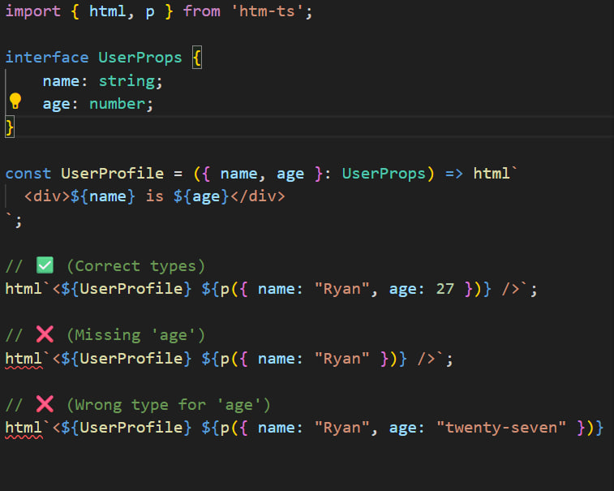

# htm-ts 

**Type-safe, fine-grained surgical reactivity for tagged templates.**



---

## Comparison Table

| Feature | `htm` | JSX (Solid) | **htm-ts** |
| :--- | :--- | :--- | :--- |
| **No Build Step** | ✅ | ❌ (Requires compiler) | **✅ Native ESM** |
| **Type-Safe Props** | ❌ | ✅ | **✅ `p()` helper anchor** |
| **Surgical Updates** | ❌ (VDOM diffing) | ✅ (Fine-grained) | **✅ Signal-driven O(Changes)** |
| **Bundle Size** | ~600b (parser only) | ~5KB+ (runtime) | **~2.6KB (Full Runtime)** |

---

##  The Why: Solving the TypeScript "Black Hole"

TypeScript's type inference for tagged template literals has a fundamental limitation: holes (`${...}`) inside templates are typed as the union of all possible interpolated values. When you write `` html`<${Component} name=${value} />` ``, TypeScript sees the Component in a template hole and loses all type information about its props.

**htm-ts solves this** with **Expression Anchoring** via the `p()` helper. By passing props as a separate, explicitly typed object after the component reference, TypeScript can strictly validate prop types at compile time:

```typescript
const UserCard = ({ name, age }: { name: string; age: number }) => html`
  <div>${name} - ${age}</div>
`;

// ✅ Type-safe: TypeScript validates name and age
html`<${UserCard} ${p({ name: "Sam", age: 25 })} />`;

// ❌ Compile-time error: age must be a number
html`<${UserCard} ${p({ name: "Sam", age: "twenty-five" })} />`;
```

---

## 🛠 Basic Usage

```typescript
import { html, render, signal, p } from 'htm-ts';

// Create reactive state
const [count, setCount] = signal(0);

// Component functions run ONCE during initial render
// Subsequent updates are surgical - only the changed text nodes update
const Display = ({ value }: { value: () => number }) => html`
  <span>Value is: ${value}</span>
`;

const App = () => html`
  <div style="padding: 2rem; font-family: system-ui;">
    <!-- The h1 and button render once. The ${count} text node updates surgically. -->
    <h1>Count: ${count}</h1>
    <button onclick=${() => setCount(count() + 1)}>+</button>
    
    <!-- Props strictly validated at compile time via p() -->
    <${Display} ${p({ value: count })} />
  </div>
`;

// Mount to DOM
render(App(), document.body);
```

**Key insight**: Unlike React where components re-run on every state change, `htm-ts` uses Solid's surgical reactivity model. The `App` function executes once during setup. Signal changes bypass component functions entirely and update only the specific DOM nodes that depend on them.

---

## 🏗 Project Structure & Scripts

```
htm-ts/
├── src/           # Core library source
├── test/          # Test suite
├── examples/      # Runnable examples
├── dist/          # Build output
└── README.md      # This file
```

### Available Scripts

| Script | Command | Description |
|--------|---------|-------------|
| `build` | `pnpm build` | Build distribution files |
| `dev` | `pnpm dev` | Start Vite dev server |
| `example` | `pnpm example` | Run examples/ demo |
| `test` | `pnpm test` | Run test suite |
| `typecheck` | `pnpm typecheck` | Type-check TypeScript |

---

## 🧠 Technical Deep Dive: How It Works

### Tail-Recursive Template Literal Types

The `html` tagged template uses TypeScript's type system as a parser. The `ValidateEach` type recursively walks through template string segments at compile time:

```typescript
type ValidateEach<T extends readonly string[]> =
    T extends readonly [infer Head, ...infer Tail]
    ? Head extends string
        ? ValidateSegment<Head> extends true
            ? Tail extends readonly string[] ? ValidateEach<Tail> : true
            : ValidateSegment<Head>
        : true
    : true;
```

This validates HTML tag names against the `HTMLElements` union, catching typos like `<divv>` at the type level.

### Signal-Aware Runtime

The renderer wraps signal accessors in effects. When a signal updates, only the bound DOM nodes update:

```typescript
// This runs once during setup, creating a reactive binding
html`<div>${() => count()}</div>`

// When count() changes, only the text node's data property updates
// No component re-render, no VDOM diff, no reconciliation
```

The runtime tracks dependencies via a simple subscription model:

1. **Read phase**: When a signal's getter is called inside an effect, the effect subscribes
2. **Write phase**: When the signal's setter is called, all subscribers are notified
3. **Update phase**: Effects re-run, surgically updating only changed DOM attributes/text

---

## 🏁 Installation

```bash
pnpm add htm-ts
```

Or using npm:

```bash
npm install htm-ts
```

[](https://stackblitz.com/github/Samuel-Fikre/htm-ts?file=index.html,main.ts)